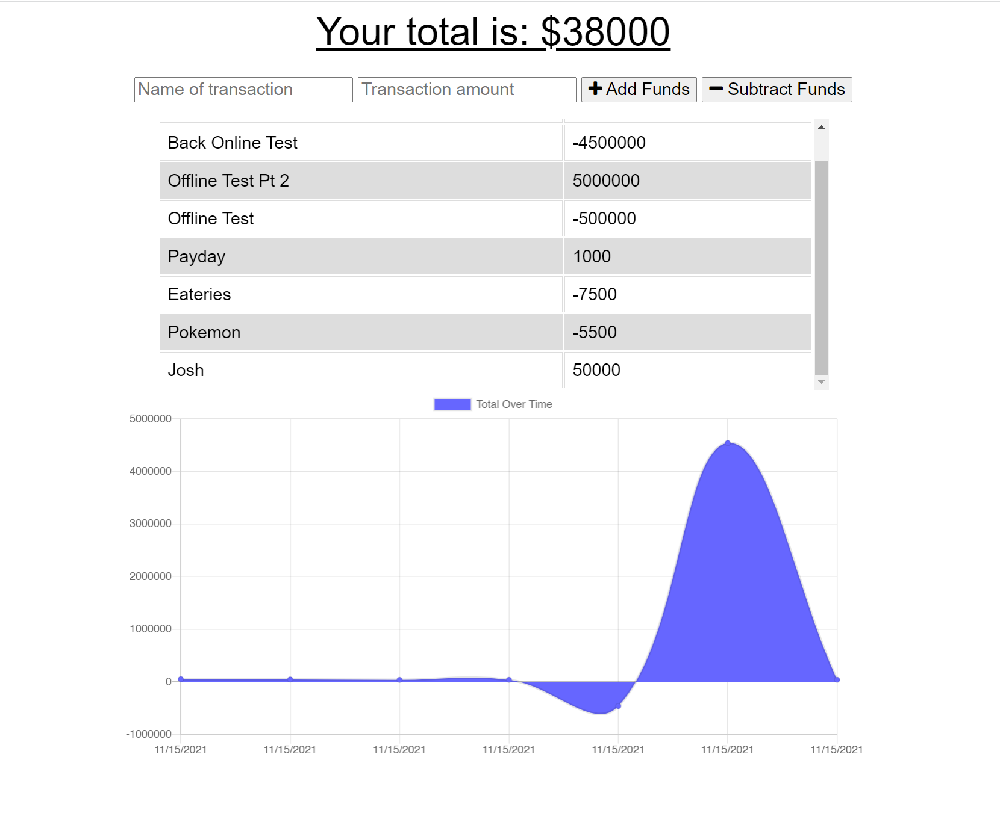

# Budget Tracker

[](https://opensource.org/licenses/MIT)

## Description

This application is a PWA that allows a user to track their finances with added offline functionality.

[Link to deployed application on Heroku](https://jkw-budget-tracker.herokuapp.com/)

[](https://jkw-budget-tracker.herokuapp.com/)

## Table Of Contents

- [Installation](#!installation)

- [Usage](#usage)

- [License](#license)

- [Contributing](#contributing)

- [Tests](#tests)

- [Questions](#questions)

================================================

## Installation

To install the necessary dependencies, please run the following command:

```
npm i
```

================================================

## Usage

None

================================================

## License

This project is licensed under the MIT license.

================================================

## Contributing

None

================================================

## Tests

To test if the dependencies are all installed, please run the following command:

```
npm test
```

================================================

## Questions

If you have any questions please reach out to me [HERE](mailto:josh@joshwatkins.photo). You can find more of my work at [MY GITHUB](https://www.github.com/joshuakwatkins/).
